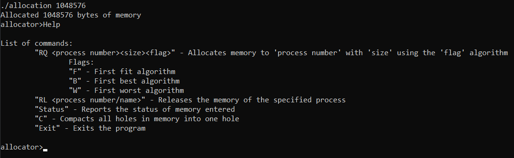
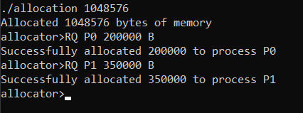
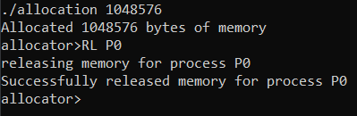
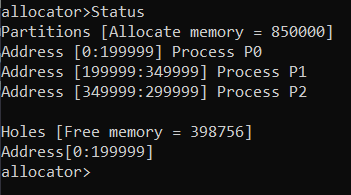
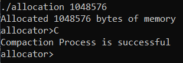

# Memory Allocator CP386 Assignment 4
Memory allocation program that simulates the memory allocation processes in  a operating system

# Make file
The program is compiled in ubuntu use the makefile.

Command: 
```
make run
```
# Features

- Request function:
  The Request function takes 3 parameters: a Process id, size required and algorithm flag. It allocates the size in memory for that processs according to the algorithm specified by the user

- Release function:
  The Release function takes the process id of an existing process in memory and frees that space in memory.

- Status:
  List all the process in memory, all the holes or free spaces in memory and the total space in memory that is being used

- Holes Compaction:
  If there are multiple free spaces in memory those spaces are combined in to one when this command is envoked by the user.
  
# Screenshots










# About Developers

Wrenen D'Cunha (Wrenen) - Student at Wilfrid Laurier University

Muhammad Zafar (keyfive5) - Student at Wilfrid Laurier University

# Lisence
This project is licensed under the [MIT License](https://github.com/keyfive5/Assignment-4/blob/main/LICENSE.txt).
